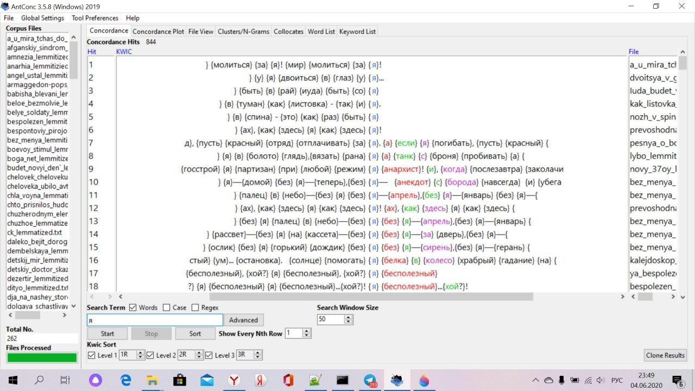
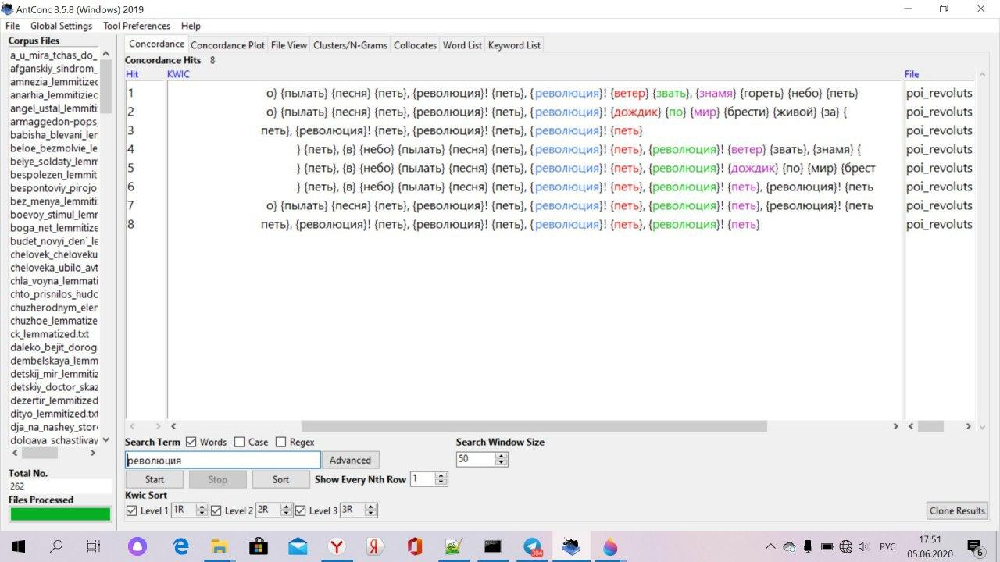
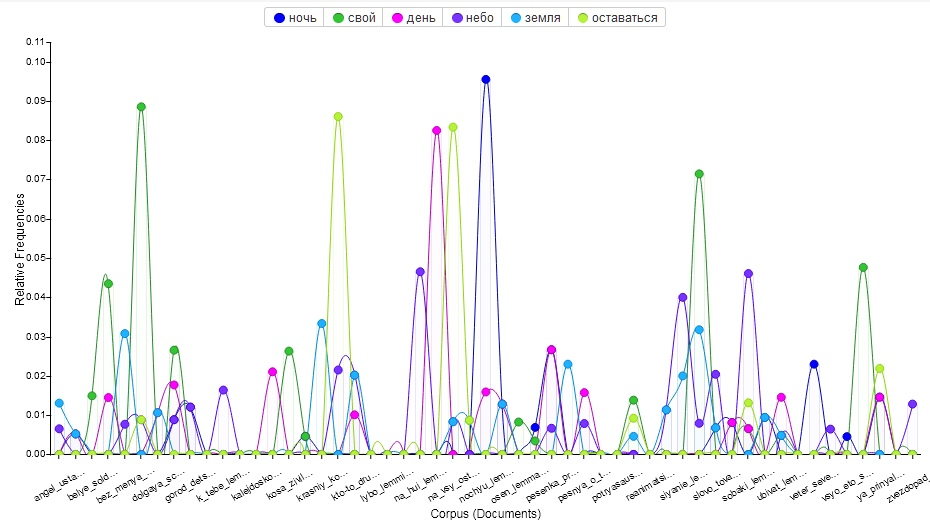

# Корпус текстов песен Егора Летова #
### "Гражданская Оборона"
Егор Летов (настоящее имя Игорь) - лидер и единственный постоянный участник группы "Гражданская оборона". Сама группа то собиралась, то распадалась, однако оставила за собой множество альбомов, тексты к которым писал сам Летов.
Эти песни интересны нам из-за нескольких их особенностей: 
- часто в них можно найти отсылки к литературным произведениям;
- язык Егора Летова, хоть и может показаться непонятным и нестройным на первый взгляд, заслуживает особого внимания; 
- в песнях отражены взгляды Летова на жизнь, менявшиеся при любопытнейших обстоятельствах. И именно этот факт отсылает нас к ***мотиву экзистенции*** в творчестве Егора Летова.

Цель нашего проекта - исследовать тексты Егора Летова, определить самые частотные слова, фигурирующие так или иначе в творчестве "Гражданской обороны", и, основываясь на результатах, проследить: как отразились мотивы экзистенции в песнях исследуемой нами группы?

## Mystem
 [Тексты, лемматизированные в Mystem](https://drive.google.com/drive/folders/1yWufARbfCB8lO3J1MPvItdyefYHSiKtk?usp=sharing)
# AntConc
## Частотный список слов

## Конкордансы 10 самых частотных слов, связанных с экзистенцией
Мы выбрали для анализа сочетаемости самые используемые слова в текстах и те слова, которые напрямую связаны с мотивом существования и бытия.

1."в"

Конкорданс предлога "в" - неотъемлемая часть анализа мотива экзистенции. У Летова этот предлог, как мы видим, очень часто используется в контексте веры в какие-либо принципы.

2."я"

Конкорданс слова "я" в основном отдает некоторой безысходностью. Постоянно используются слова "без", "бесполезный", "беспонтовый".

3."мы"

Конкорданс слова "мы" более агрессивный, а временами и более оптимистичный, однако упомянутые выше слова тоже встречаются. 

4."быть"

В конкордансах слова "быть" видно, что Летов в своих песнях часто обращается к метафизическим мотивам, в том числе к религии. Примечательно, что рядом с "быть" можно найти интересные слова, например, "безграничный". Это опять же связано с мотивом экзистенции в творчестве музыканта. Его мир, как мы можем увидеть, широк и многообразен.

5."жить"

Конкордансы слова "жить" также неоднозначны, что подтверждает сказанное нами во вступлении предположение о том, что жизнь Летова имеет множество различных красок.

6."мой"

Конкордансы слова "мой", в отличие от "я", выглядят, скажем, величественно. Будто бы то, что принадлежит или относится к лирическому герою, действительно важно и безупречно.

7."день"

Конкордансы "день", как и многие предыдущие, неоднозначны. День у Летова может быть новым, прекрасным, удивительным и достойным упоминания, а может быть каким-то безысходно-грустным, обреченным.

8."мир"

Как мы видим, в конкордансах слова "мир" видны обращения Летова к глобальным структурам, причем на скриншоте больше всего позитивных сочетаний, однако мы все же видим тесную связь слов "мир" и "умирать"

9."небо"

На наш взгляд, в конкордансах слова "небо" есть два самых ярких сочетания - "милость" и "злой". Это снова относит нас к мысли о неоднозначности бытия, потому что небо для Летова, как и для любого поэта (а его называют поэтом русского рока) значит нечто большее, чем просто купол атмосферы над головой.

10."умирать"

Конкордансы этого слова крайне интересны, ведь смерть чаще всего выступает или как общественное явление, или как акт перехода в новую фазу. 

А также невозможно не отметить, что Летов работает с историко-политическими терминами и фактами. Известно, что сам он был коммунистом, поэтому конкордансы слов "Ленин", "коммунизм" и "революция" позитивны и даже в лемматизированном виде напоминают "бодрые марши" или выкрики толпы.

1."ленин"

2."коммунизм"

3."революция"

## Google Ngrams

Мы решили также провести исследование в Google Ngrams, пытаясь отследить динамику употреблений имени музыканта в Google Books. Благодря этим сведениям мы поняли, что имя Егора Летова стало употребляться в книгах с 1987 года, как раз через 2 года после первого альбома "Гражданской обороны". На время его имя утратило популярность в книгах, однако с 2008 и теперь периодически набирает ее, хотя, конечно,  самый пик пришелся именно на 90-е годы.

## Voyant Tools
### Наблюдения:
* Общее количество слов в корпусе - 30 391, из них уникальных словоформ - 5194
* Больше всего слов было написано в 80-е и 90-е и меньше всего, конечно, в 2000-х, однако уникальные слоформы по числу почти идентичны: в 90-х - 2358, а в 00-х - 1941
* 

Стоит отметить, что тексты Летова разительно отличтся друг от друга по общему настрою. Нельзя сказать, Гражданская оборона поет нечто мрачное - конечно, на скриншотах видно, что часто в текстах содержится бызысходный, злой, печальный посыл, но это не закономерность. Жизнь для Летова многогранна. Он связывает ее и с хорошими, и с дурными моментами.
